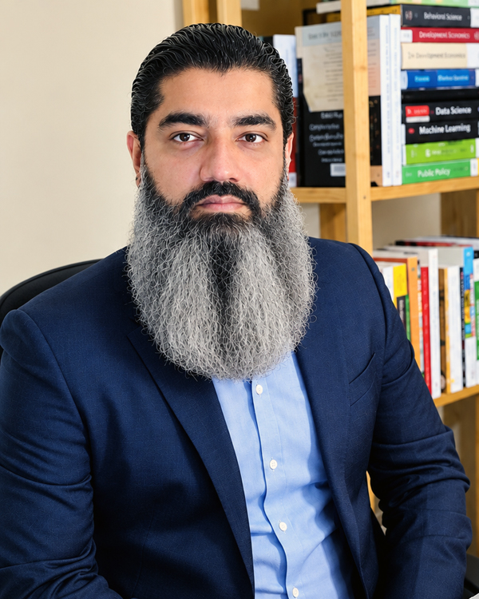

::: {.hero}
::: {.hero-main}

Academic profile

# Muhammad Usman Amin Siddiqi, PhD

Energy & Environmental Policy · Public Opinion · Behavioural Science

<strong>Postdoctoral Research Associate</strong>, Department of Psychology, University of Bath <strong>Honorary Research Fellow</strong>, Centre for Energy Policy, University of Strathclyde

I am an interdisciplinary social scientist studying how people understand, evaluate and respond to climate change, energy transitions, environmental risks and emerging energy technologies. My work connects public opinion and behavioural science with questions of policy design, social acceptance and the distribution of costs and benefits.

<a class="btn-academic" href="research.html">Explore research</a>
<a class="btn-academic-outline" href="publications.html">Publications</a>
<a class="btn-academic-outline" href="files/Muhammad-Usman-Amin-Siddiqi-CV.pdf">Download CV</a>

<a href="https://researchportal.bath.ac.uk/en/persons/muhammad-usman-siddiqi/">University of Bath</a>
<a href="https://scholar.google.com/citations?hl=en&user=nRKBXkgAAAAJ">Google Scholar</a>
<a href="https://orcid.org/0000-0003-0168-3029">ORCID</a>

:::

::: {.hero-visual}

:::
:::

Research focus

## Social dimensions of climate and energy transitions

My research asks a practical question: what makes climate and energy transitions not only technically possible, but also publicly acceptable, behaviourally realistic and socially responsive?

::: {.card-grid}
::: {.research-card}

01

### Energy transitions & public acceptance

Public perceptions of hydrogen, ammonia, offshore renewable energy and the infrastructure needed for low-carbon energy systems.
:::

::: {.research-card}

02

### Climate risk & behaviour

How extreme weather, perceived harm, information and social interaction shape preparedness, climate action and policy support.
:::

::: {.research-card}

03

### Public opinion & environmental policy

How knowledge, values, political and social identities, and perceived costs and benefits influence policy preferences.
:::
:::

::: {.band}

Current project

## Ocean-REFuel: public acceptance of future energy systems

At the University of Bath, I contribute to **Ocean-REFuel**, an EPSRC-funded interdisciplinary programme examining the conversion of ocean renewable energy into zero-carbon hydrogen and ammonia fuels. My work focuses on public attitudes, acceptance, policy support and the social dimensions of emerging energy systems.

<a class="btn-academic" href="research.html#ocean-refuel">Current research →</a>
:::

Selected recognition

## Awards and academic recognition

::: {.recognition-grid}
::: {.recognition-card}

2024

Charles Redd Award

Best Paper on the Politics of the American West.

:::
::: {.recognition-card}

2017–2023

Fulbright Scholar

Fulbright Foreign Student Program Scholarship for doctoral study at Oregon State University.

:::
::: {.recognition-card}

2008

Gold Medal

MA Political Science, with Academic Roll of Honor.

:::
:::

Selected work

## Recent publications

::: {.pub-list}
::: {.pub-card}

2026 · <em>npj Climate Action</em> · Open access

Seeing is believing or believing is seeing: divergent pathways to climate action and policy support following extreme weather events

Siddiqi, M. U. A., Giordono, L., Peterson, H. L., Zanocco, C., Stelmach, G., Flora, J., & Boudet, H.

About the paper

Using survey data from wildfire-affected Oregon and hurricane-affected Alabama, this study separates the factors associated with climate-related actions from those associated with mitigation and adaptation policy support.

<a class="pub-btn" href="https://www.nature.com/articles/s44168-026-00381-3">Read article ↗</a>

:::

::: {.pub-card}

2026 · <em>Energy Policy</em> · Open access

Community benefit agreement preferences for energy development offshore California, Oregon, and Washington: Insights from a choice-based conjoint experiment

Taufiq, H. A., Stelmach, G., Rahman, U., Siddiqi, M. U. A., & Boudet, H.

About the paper

A choice-based conjoint experiment with 2,999 West Coast respondents examines how benefit size, recipients and fund management shape preferences for community benefit agreements linked to offshore renewable energy.

<a class="pub-btn" href="https://www.sciencedirect.com/science/article/pii/S0301421526002090">Read article ↗</a>

:::

::: {.pub-card}

2025 · <em>Environmental Policy and Governance</em> · Open access

Understanding public preferences for energy efficiency policies in building and agricultural sectors in the western US: Values, knowledge, and identity

Siddiqi, M. U. A., & Wolters, E. A.

About the paper

Using a four-state survey, this paper examines how ideology, environmental values, social identities and policy literacy are associated with support for energy-efficiency policies in buildings and agriculture.

<a class="pub-btn" href="https://onlinelibrary.wiley.com/doi/full/10.1002/eet.2131">Read article ↗</a>

:::
:::

<a class="btn-academic-outline" href="publications.html">View all publications →</a>

Academic profile

## Research, teaching and international experience

::: {.stat-grid}
::: {.stat}
<strong>67 sections</strong>
University teaching across two universities
:::
::: {.stat}
<strong>39 students</strong>
Supervised across MPhil, MA and BA research projects
:::
::: {.stat}
<strong>UK · USA · Pakistan</strong>
Research, teaching and academic leadership
:::
:::

Recent activity

## Talks and engagement

::: {.activity-list}

May 2026<strong>Invited talk</strong> — Governing the Green Transition, Centre for Energy Policy, University of Strathclyde.

May 2026<strong>Invited panellist</strong> — Shetland at the Frontline of the Energy and Net Zero Transition, All-Energy, Glasgow.

Apr 2026<strong>Research presentation</strong> — Public acceptance of hydrogen and alternative liquid fuels, Portsmouth.

:::

<a class="btn-academic-outline" href="talks.html">View talks & presentations →</a>

::: {.contact-strip}
<strong>Interested in collaboration?</strong>
I welcome conversations about energy transitions, public acceptance, climate behaviour and environmental policy.
<a href="mailto:muas21@bath.ac.uk">muas21@bath.ac.uk</a>
:::
